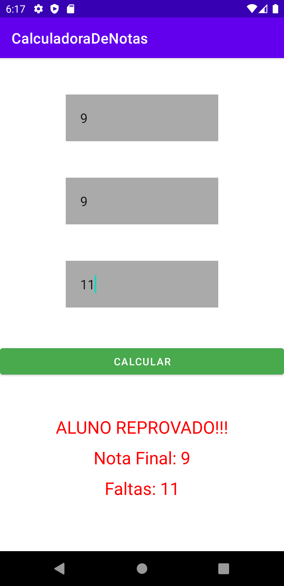
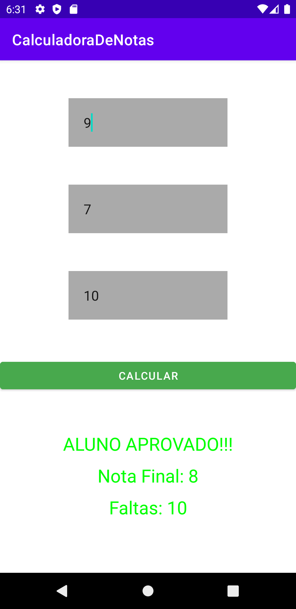

# Digital Innovation One

## Santander Mobile Developer - Trabalhando com o Android Studio e Principais Ferramentas

 

## Sobre o Projeto

**O QUE APRENDI**

- INSTAÇÃO DO SDK E ANDROID STUDIO
- ESTRUTURA DE PASTAS
- MONTAGEM DE LAYOUT 
- DESENVOLVIMENTO BÁSICO NA MAINACTIVITY

## Preview :framed_picture:

## Technologies :microscope:

## License :memo:

This project is licensed under the MIT License. See the [LICENSE](https://github.com/pauloeduardo2906/CalculadoraDeNotas/blob/main/LICENSE "LICENSE") file for details.

 

**
Made by Paulo Eduardo Jr. Enjoy it!
**
